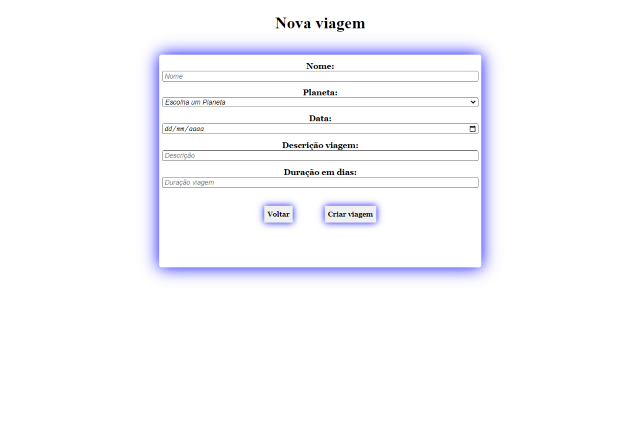

# LabeX  🚀

*Site de Viagens interplanetárias*

## Projeto
Realizado no módulo de Frontend do curso de desenvolvimento Wep da Labenu.

### Tecnologias:
- API fornecida pela mesma.
- linguagem de programação Javascript.
- Biblioteca React.
- Axios.
- Hooks.
- Styled components.

*Link:*
[==> Link surge AQUI!<==](https://tightfisted-space.surge.sh/)

###### Rodando em:
- Desktop 
- Mobile (testes realizados em: Iphone XR, Iphone 5/6/7, Android) 

# Funcionalidades:
Dividido em área privada (Administrativo) e área pública.

Entre suas finalidades:

# Área Pública:

- Usuário podendo visualisar as viagens.

- Usuário podendo se candidatar a qualquer viagem cumprindo os requisitos do formulário.

# Área Privada (administrativo):

 *área privada com acesso somente com autenticação.*

- Somente funcionários somente podendo ter acesso com seu email e senha.
*Email:*
caroline-martins-barros@astrodev.com
*Senha:*
123456

- Ao entrar o ADM tem acesso a todas as viagens podendo deleta-las ou ver mais detalhes.

- Formulário para criar novas viagens apartir de requisitos básicos.

- Detalhes das viagens contendo os candidatos que se inscreveram e aguardam aprovação podendo aceitar sua inscrição ou recusar.

